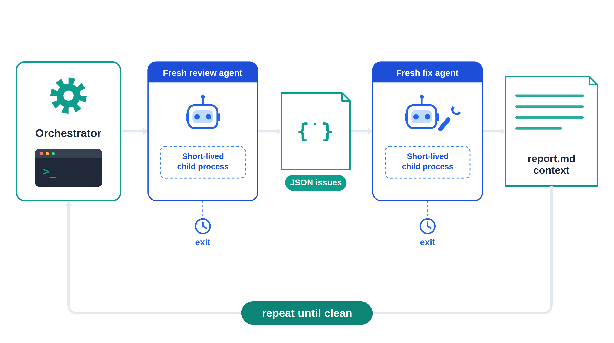
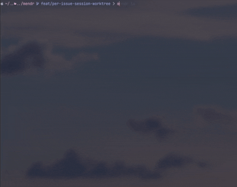

<p align="center">
  
</p>

# mendr

[](package.json)
[](LICENSE)
[](tsconfig.json)
[](https://github.com/Pepps233/mendr/actions/workflows/ci.yml)

**mendr** orchestrates your installed Codex or Claude Code CLIs as short-lived workers, running through their local CLIs on your existing subscriptions, so there are no API keys to collect or manage. Point it at a GitHub pull request, choose `claude` or `codex`, and it scans the PR for scoped issues; when it finds a problem, it launches a fix agent, commits and pushes the fix, then reviews the PR again, repeating until the PR is clean or the configured round cap is reached.

**mendr** is built on principles from the [Loop Engineering paper](https://drive.google.com/file/d/1qzKI4DKnyHRpXK1J3ATPqwaqLc0iNu-M/view): repeated discovery, handoff, verification, persistence, and scheduling. In practice, that means it:

- Treats the main loop as deterministic TypeScript orchestration, not another long-running LLM session.
- Launches a fresh one-shot review or fix agent for each step.
- Automates the review, fix, and validate cycle instead of leaving you to manually reprompt agents.
- Carries context through `report.md`.
- Writes review state to disk so `mendr ls` and `mendr view <id>` can inspect in-flight work.
- Posts one final PR summary comment instead of scattering review noise across the PR.

Every review and fix step starts a new agent process to isolate reviewer from fixer.
Claude Code sessions run through `claude -p` with JSON output and repository access through `--add-dir`.
By default, Claude Code uses `claude-opus-4-8` with `high` effort.
Codex sessions run through `codex exec` with `--sandbox workspace-write`, `-C <repo>`, and final-message capture.
By default, Codex uses `gpt-5.5` with `xhigh` effort.

The orchestrator never uses `--continue`, `--resume`, or a reused agent process.
This keeps each step isolated and releases memory when the child process exits.
Continuity comes from `report.md`, which is embedded in every subsequent review and fix prompt.

## CLI

```sh
mendr <agent> <pr> [--rounds <n>] [--model <model>] [--effort <effort>]
mendr ls
mendr view <id>
mendr stop <id>
mendr kill <id>
```



`agent` must be `claude` or `codex`.
`pr` may be a pull request number or a pull request URL.
`--rounds` and `-r` set the maximum review and fix iterations, with a default of `3`.
`--model` and `-m` override the agent model for that review.
`--effort` and `-e` override the agent effort for that review.
Codex accepts `low`, `medium`, `high`, or `xhigh`.
Claude Code accepts `low`, `medium`, `high`, `xhigh`, or `max`.
Set `MENDR_CODEX_MODEL`, `MENDR_CODEX_EFFORT`, `MENDR_CLAUDE_MODEL`, or `MENDR_CLAUDE_EFFORT` to change unattended defaults.

## Example

```sh
mendr codex 42
mendr ls
mendr view swift-otter-3f9a
```

After the daemon starts, the original terminal can close.
The review continues in the background, and `view` follows the file-backed status stream.

## Requirements

- Node.js `20` or newer.
- Git.
- GitHub CLI `gh`, installed and authenticated.
- One or both agent CLIs, depending on usage:
  - `claude` for Claude Code.
  - `codex` for Codex.

**mendr** shells out to installed Codex or Claude Code CLIs and uses your existing subscriptions and local authentication.
It does not require API keys, collect credentials, or manage model provider secrets.

## Installation

```sh
npm install -g mendr
```

After installation, run:

```sh
mendr --help
```

## Report Format

The final pull request comment is generated from `report.md`.
The report starts with exactly one Mendr summary heading and groups resolved and unresolved issues under dedicated sections.
Each issue block includes a hidden fingerprint comment so same-title issues remain distinct.

```md
## Summary by Mendr

### Resolved Issues

#### <issue found by review agent>
<!-- mendr-issue-fingerprint: <encoded issue fingerprint> -->
**Commit:** <commit sha>
<two sentences on how it was fixed>

### Unresolved Issues

#### <issue requiring follow-up>
<!-- mendr-issue-fingerprint: <encoded issue fingerprint> -->
<why Mendr could not safely record a fix>

### Round Cap

Reached after <round count> rounds with <open issue count> open issues:
- <open issue found by review agent>
```

When the round cap is reached or a fix fails, the report records that state instead of claiming success.

## Development

Clone the repository and install dependencies:

```sh
npm ci
```

Run the local checks:

```sh
npm run typecheck
npm test
npm run build
```

## Contributing

Contributions are welcome, and changes should keep the orchestration model deterministic and testable.
Before opening a pull request:

1. Create a focused branch.
2. Add or update tests for behavior changes.
3. Run `npm run typecheck`, `npm test`, and `npm run build`.
4. Follow `.github/pull_request_template.md`.
5. Include clear reasoning for CLI, daemon, agent-driver, state, or report-format changes.

Do not commit generated build output unless a maintainer explicitly asks for it.
Do not edit generated files manually.

## License

**mendr** is released under the MIT License.
See [LICENSE](LICENSE) for details.
