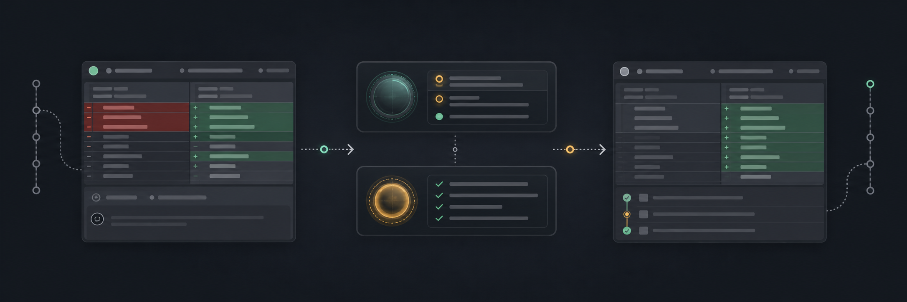
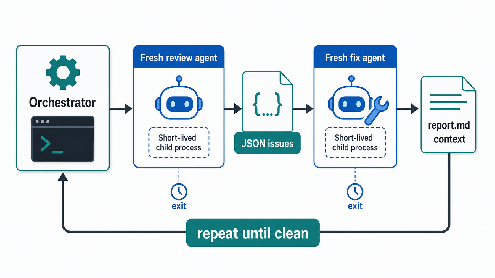

<p align="center">
  
</p>

# mendr

[](package.json)
[](LICENSE)
[](tsconfig.json)
[](https://github.com/Pepps233/mendr/actions/workflows/ci.yml)

Autonomous pull request code review for terminal-native workflows.

`mendr` is a TypeScript CLI that orchestrates installed coding-agent CLIs as short-lived workers.
Point it at a GitHub pull request, choose `claude` or `codex`, and it continuously scans the PR for scoped issues.
When it finds a problem, `mendr` launches a fix agent, commits and pushes the fix, then reviews the PR again until no issues are left or the configured round cap is reached.

## Why mendr

Code review agents are most useful when they stay scoped, leave an audit trail, and can be stopped or inspected without keeping a terminal session open.
`mendr` is designed around those constraints:

- It treats the main loop as deterministic TypeScript orchestration, not another long-running LLM session.
- It launches a fresh one-shot review or fix agent process for each step.
- It carries continuity through `report.md`, which is injected into every later prompt.
- It writes review state to disk so `mendr ls` and `mendr view <id>` can inspect in-flight work.
- It posts one final pull request summary comment instead of scattering review noise across the PR.

## How It Works

```text
mendr <agent> <pr>
  |
  +- detached daemon
       |
       +- fetch PR body, comments, and diff with gh
       +- run review agent for scoped issue discovery
       +- run fix agent for each issue
       +- commit and push fixes through the agent workflow
       +- append resolved issues to report.md
       +- repeat until clean or the round cap is reached
       +- post report.md as a single PR comment
```

The review agent is responsible for finding issues strictly inside the pull request's changed scope.
The fix agent is responsible for editing, committing, and pushing a fix for a single issue.
The orchestrator owns the loop, persistence, status events, and final report.
That loop is what lets `mendr` keep scanning the same pull request and autonomously push fixes until the review comes back clean.

## CLI

```sh
mendr <agent> <pr> [--rounds <n>]
mendr ls
mendr view <id>
mendr stop <id>
```

`agent` must be `claude` or `codex`.
`pr` may be a pull request number or a pull request URL.
`--rounds` and `-r` set the maximum review and fix iterations, with a default of `3`.

## Example

```sh
mendr codex 42
mendr ls
mendr view swift-otter-3f9a
```

After the daemon starts, the original terminal can close.
The review continues in the background, and `view` follows the file-backed status stream.

## Requirements

- Node.js `20` or newer.
- Git.
- GitHub CLI `gh`, installed and authenticated.
- One or both agent CLIs, depending on usage:
  - `claude` for Claude Code.
  - `codex` for Codex.

`mendr` shells out to installed CLIs and uses their existing authentication.
It does not collect API keys or manage model provider credentials.

## Installation

```sh
npm install -g mendr
```

After installation, run:

```sh
mendr --help
```

## Agent Session Model

<p align="center">
  
</p>

Every review and fix step starts a new agent process.
Claude Code sessions run through `claude -p` with JSON output and repository access through `--add-dir`.
Codex sessions run through `codex exec` with `--sandbox workspace-write`, `-C <repo>`, and final-message capture.

The orchestrator never uses `--continue`, `--resume`, or a reused agent process.
This keeps each step isolated and releases memory when the child process exits.
Continuity comes from `report.md`, which is embedded in every subsequent review and fix prompt.

## Report Format

The final pull request comment is generated from `report.md`.
The report starts with exactly one summary heading and appends one entry per resolved issue.

```md
## Summary
- Issue: <issue found by review agent>
- Resolved by: <commit sha>
- <two sentences on how it was fixed>
```

When the round cap is reached or a fix fails, the report records that state instead of claiming success.

## Development

Clone the repository and install dependencies:

```sh
npm ci
```

Run the local checks:

```sh
npm run typecheck
npm test
npm run build
```

## Contributing

Contributions are welcome, and changes should keep the orchestration model deterministic and testable.
Before opening a pull request:

1. Create a focused branch.
2. Add or update tests for behavior changes.
3. Run `npm run typecheck`, `npm test`, and `npm run build`.
4. Follow `.github/pull_request_template.md`.
5. Include clear reasoning for CLI, daemon, agent-driver, state, or report-format changes.

Do not commit generated build output unless a maintainer explicitly asks for it.
Do not edit generated files manually.

## License

`mendr` is released under the MIT License.
See [LICENSE](LICENSE) for details.
